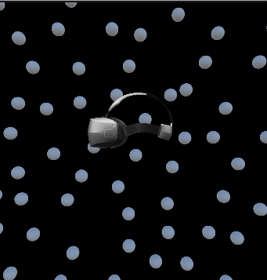
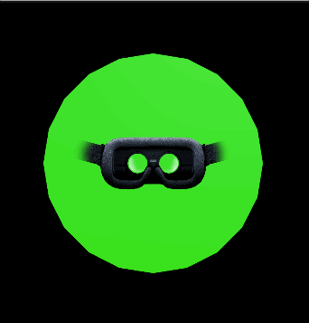
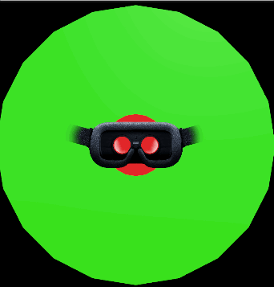
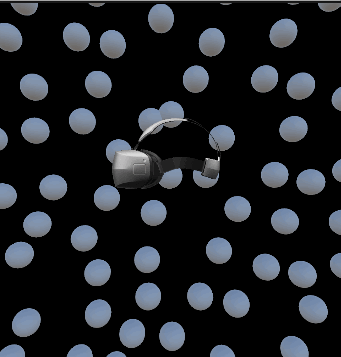
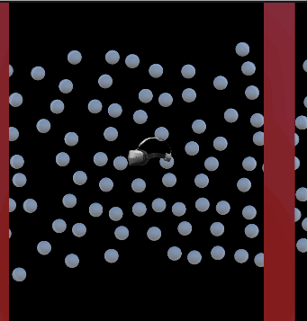

# HVV Oculus

 

## About

---

 
HVV Oculus is a tool for researching vestibular stimulation in individuals using virtual reality. This tool provides a control panel which can be used by researchers to manage simulation environments in real-time while a participant is immersed in the simulation
  

## Quickstart

---

1. Download the most [recent release](https://github.com/DaviesCooper/HVVOculus/releases/tag/v1.0.0.0)
2. Extract to wherever you want.
3. With your Oculus Quest connected to your PC, and with Quest Link enabled, run `HVV Oculus.exe` on your computer.

 

> **Note**
>
> ### Enable Oculus Quest Link
>
> To enable oculus quest link you can follow the [official guide](https://www.meta.com/help/quest/articles/headsets-and-accessories/oculus-link/connect-link-with-quest-2/). Alternatively, [here is a quick video](https://www.youtube.com/watch?v=9HfLWkm8zCI) you can watch which demonstrates it visually.

 

## Usage

---

When using HVV Oculus the participant should put the VR headset after the program has started. Once inside they will be able to see nothing. This is because HVV Oculus provides control to the researcher who should be managing the simulation from the connected computer. Only when the researcher clicks on `Send To Headset` will anything be visibile for the participant.

Upon changing the parameters of the simulation, all changes will only be visible to the researcher until `Send To Headset` is pushed at which point the currently set parameters will be displayed for the participant.

 

## Parameters

---

### Generation Parameters

-   The generation parameters are parameters which will cause for the particle to be regenerated. Changing one of these parameters will randomly create a new batch of particles.

### Runtime Parameters

-   The runtime parameters are parameters which can be modified at any point in time and will have no effect on the creation of particles.

| Name                | Value                   | Units             | Description                                                                                                                                                                                                                                                                                                                                                                                                                   | Example                                                                                                 |
| ------------------- | ----------------------- | ----------------- | ----------------------------------------------------------------------------------------------------------------------------------------------------------------------------------------------------------------------------------------------------------------------------------------------------------------------------------------------------------------------------------------------------------------------------- | ------------------------------------------------------------------------------------------------------- |
| Number of Particles | (0 - inf)               | N/A               | The number of particles to generate                                                                                                                                                                                                                                                                                                                                                                                           | N/A                                                                                                     |
| Particle Radius     | (0 - inf)               | m                 | The radius of each particle                                                                                                                                                                                                                                                                                                                                                                                                   |                                                   |
| Generation Radius   | (0- inf)                | m                 | The radius extending outward from the center of the headset which the particles can generate. This is represented by the green circle in the example gif.                                                                                                                                                                                                                                                                     |                                                 |
| Generation Length   | (0- inf)                | m                 | The length the particles should generate. In essence the particles will be created in a cylinder of this length in either direction. Thus, in any given direction the particles will extend half this length. This is represented by the green cylinder in the example gif.                                                                                                                                                   |                                                 |
| Exclusion Radius    | (0 - Generation Radius) | m                 | The radius within the generated radius which particles will not be able to spawn within. If the green circle represents the generation radius, then the red circle represents the exclusion radius in the example gif.                                                                                                                                                                                                        |                                                  |
| Velocity            | (0 - inf)               | m/s               | The velocity of the particles.                                                                                                                                                                                                                                                                                                                                                                                                |                                                          |
| Travel Length       | (0 - Generation Length) | m                 | The length the particles will be able to travel. Similar to the generation length, this is centered on the headset. This is represented by the two red lines which the particles travel between in the example gif.                                                                                                                                                                                                           |                                                     |
| Fix Camera          | toggle                  | N/A               | Sets whether or not the particles are fixed to the rotation of the camera. When set the particles are fixed to the camera. when                                                                                                                                                                                                                                                                                               |   |
| Show Floor          | toggle                  | N/A               | Toggles the floor being visible or not.                                                                                                                                                                                                                                                                                                                                                                                       | N/A                                                                                                     |
| Show Crosshairs     | toggle                  | N/A               | Toggles the crosshairs being visible or not                                                                                                                                                                                                                                                                                                                                                                                   | N/A                                                                                                     |
| Mask CoV            | toggle                  | N/A               | Toggles the display of the visual mask. The visual mask acts as a means to occlude either the peripheral or central vision of the participant based on the mask radius, and invert mask parameters. The mask technically exists 0.33m in front of the participants center of vision (which is how you will be calculating the degrees of vision).                                                                             | N/A                                                                                                     |
| Mask Radius         | (0-1)                   | radial percentage | Starting from the center of the screen, the mask radius is how much of the screen will be covered by the mask. For example, a mask radius of 1 indicates that a circular mask should be drawn from the center of vision directly to the edge of the screen (whichever direction is shorter, width, or height). This will cause the corners to still be visible though due to the geometry of a circle set inside a rectangle. |                                                   |
| Invert Mask         | toggle                  | N/A               | When the CoV mask is inverted, rather than the center of vision being occluded, the mask occludes the exterior. Thus the value set for the radius will be "flipped" in that the radius will dictate how much of the center of vision should be shown"                                                                                                                                                                         |                                                 |

## Notes

---

-   If the program crashes, there will be a file named `SendToCooperIfAnythingGoesWrong.log` within the folder containing the `HVV Oculus.exe` program. Send this file to me and I will be able to diagnose any issues you may be having.

-   This markdown file technically needs to be rendered on a github page and so you will need to be on githubs site to see it properly. An offline version of this doc can be found within same folder as the `HVV Oculus.exe` named `Documentation.html`
